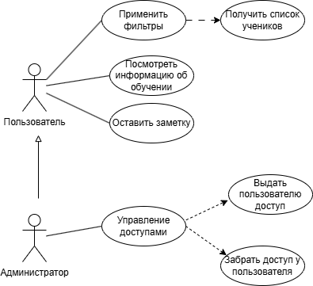

## Описание проекта

### Введение

Внутри некоторой онлайн-школы уже существует внутренняя система мониторинга учеников, реализованная как MVP. Основной фокус при разработке был сделан на скорость запуска и проверку бизнес-гипотез.

На текущий момент система закрывает базовые бизнес-задачи: сотрудники могут просматривать список учеников, отслеживать прогресс и работать с данными. Однако интерфейс перегружен, многие сценарии неудобны, а UX/UI решения формировались без полноценного продуктового и пользовательского проектирования.

---

### Цель

Цель проекта — переработать существующий MVP-модуль «Мои ученики»* и довести его до состояния MLP: сделать систему не только функциональной, но и удобной для ежедневной работы сотрудников. Основной фокус проекта — улучшение пользовательского опыта, структуры интерфейса, логики навигации и расположения ключевых действий внутри системы.

\* В системе существуют и другие модули работы, однако в рамках ШП рассматривается только выше упомянутый модуль.

---

### Проблема

Сейчас данные об учениках распределены по разным сервисам, а сотрудникам приходится вручную искать информацию о прогрессе, активности и статусе ученика. Это замедляет обработку учеников и усложняет контроль качества сопровождения.

Ситуацию усугубляет недавно принятый закон о запрете хранения и обработки информации в иностранных сервисах, нарушение которого может привести к серьёзным финансовым и юридическим рискам для бизнеса.

Проект решает задачу централизации информации:  
- менеджер получает единый интерфейс для работы с учениками  
- администратор — инструмент управления доступами сотрудников  

Ожидаемый эффект:
- сокращение SLA ответа сотрудника  
- уменьшение среднего времени обработки запроса ученика  
- повышение CSI/CSAT внутренних пользователей системы  
- снижение операционных рисков, связанных с использованием сторонних сервисов  

---

### Целевая аудитория

- **Менеджеры** — конечные пользователи системы, которые отслеживают прогресс и состояние своих учеников в одном интерфейсе  
- **Руководители секторов** — стейкхолдеры, которые отслеживают эффективность работы через бизнес-метрики сопровождения учеников  

---

## Роли пользователей

- **Менеджеры (user)** — получение информации об учениках  
- **Руководители сектора (admin)** — управление пользователями  

---

## User Story

| Как          | Хочу                                                                           | Чтобы                                          |
|--------------|--------------------------------------------------------------------------------|------------------------------------------------|
| Пользователь | загрузить список моих учеников                                                 | видеть актуальную информацию по своим ученикам |
| Пользователь | применять фильтры по образовательным метрикам (предмету, потоку, успеваемости) | быстро находить нужных учеников                |
| Пользователь | открыть детализацию ученика                                                   | посмотреть его прогресс и активность           |
| Пользователь | оставить комментарий к ученику                                                | фиксировать важную информацию                  |
| Админ        | добавлять пользователей в систему                                             | выдавать доступ новым сотрудникам              |
| Админ        | удалять пользователей из системы                                              | отключать доступ уволенным сотрудникам         |

---

## Диаграмма прецедентов

---

## Прецеденты

## Прецедент Забрать доступ у пользователя

| Раздел               | Описание                                                       |
| -------------------- | -------------------------------------------------------------- |
| Основной исполнитель | Администратор                                                  |
| Описание             | Убрать пользователя из базы, чтобы закрыть доступ к системе    |
| Предусловия          | Администратор авторизован, пользователь имеет доступ к системе |
| Постусловия          | Пользователь удален из базы                                    |

**Основной успешный сценарий.**

| Действия исполнителя                                           | Отклик системы                                                |
| -------------------------------------------------------------- | ------------------------------------------------------------- |
| 1. Администратор перешел на страницу управления пользователями | 2. Система отобразила список актуальных пользователей         |
| 3. Администратор нажимает на кнопку "Забрать доступ"           | 4. Система отображает окно подтверждения действий             |
| 5. Администратор подтверждает действие                         | 6. Система отправляет запрос на удаление пользователя из базы |
|                                                                | 7. Система закрывает окно подтверждения действия              |
|                                                                | 8. Система выводит плашку об успехе операции                  |
|                                                                | 9. Система обновляет список актуальных пользователей          |

**Альтернативный сценарий.**
5а. Если исполнитель отклоняет действие, закрыв модальное окно, прецедент возвращается к шагу 2.  
6а. Если получена ошибка от сервера, система выводит плашку об ошибке. Прецедент остается на текущем шаге.

---

## Прецедент Выдать пользователю доступ

| Раздел               | Описание                                                          |
| -------------------- | ----------------------------------------------------------------- |
| Основной исполнитель | Администратор                                                     |
| Описание             | Добавить пользователя в базу, чтобы выдать доступ к системе       |
| Предусловия          | Администратор авторизован, пользователь не имеет доступ к системе |
| Постусловия          | Пользователь был добавлен в базу                                  |

**Основной успешный сценарий.**

| Действия исполнителя                                           | Отклик системы                                                           |
| -------------------------------------------------------------- | ------------------------------------------------------------------------ |
| 1. Администратор перешел на страницу управления пользователями | 2. Система отобразила список актуальных пользователей                    |
| 3. Администратор нажимает на кнопку "Добавить пользователя"    | 4. Система отображает модальное окно с текстовым полем и кнопкой         |
| 5. Администратор вводит почту пользователя                     |                                                                          |
| 6. Администратор нажимает на кнопку "Добавить"                 | 7. Система отправляет запрос на получение пользователя из базы аккаунтов |
|                                                                | 8. Система вносит пользователя в локальную базу доступов                 |
|                                                                | 9. Система закрывает модальное окно                                      |
|                                                                | 10. Система выводит плашку об успехе операции                            |
|                                                                | 11. Система обновляет список актуальных пользователей                    |

**Альтернативный сценарий.**
6а. Пока поле почты не прошло валидацию, прецедент не переходит к шагу 7.  
7а. Если пользователь с введенной почтой не найден, система выводит плашку об ошибке и остается на текущем шаге прецедента.

---

## Прецедент Оставить заметку

| Раздел               | Описание                                          |
| -------------------- | ------------------------------------------------- |
| Основной исполнитель | Пользователь                                      |
| Описание             | Добавить заметку об ученике                       |
| Предусловия          | Пользователь авторизован, получен список учеников |
| Постусловия          | Заметка (комментарий) об ученике сохранен         |

**Основной успешный сценарий.**

| Действия исполнителя                            | Отклик системы                                                               |
| ----------------------------------------------- | ---------------------------------------------------------------------------- |
| 1. Пользователь вводит заметку в текстовом поле | 2. Система валидирует введенный текст (например, проверяет на пустую строку) |
|                                                 | 3. Кнопка "Сохранить" становится активной                                    |
| 4. Пользователь нажимает на кнопку "Сохранить"  | 5. Система создает запись в БД                                               |
|                                                 | 6. Система уведомляет об успешности операции                                 |
|                                                 | 7. Система убирает свечение кнопки "Сохранить"                               |

**Альтернативный сценарий.**
2а. Если пользователь стирает введенные символы ИЛИ оставляет тот же текст, что раннее был сохранен в поле, прецедент не переходит к шагу 3.

---

## Прецедент Посмотреть информацию об обучении

| Раздел               | Описание                                                  |
| -------------------- | --------------------------------------------------------- |
| Основной исполнитель | Пользователь                                              |
| Описание             | Посмотреть информацию об образовательных метриках ученика |
| Предусловия          | Пользователь авторизован, получен список учеников         |
| Постусловия          | Отображена информация об обучении                         |

**Основной успешный сценарий.**

| Действия исполнителя                             | Отклик системы                                                           |
| ------------------------------------------------ | ------------------------------------------------------------------------ |
| 1. Пользователь находит нужного ученика в списке |                                                                          |
| 2. Пользователь нажимает на кнопку "Подробнее"   | 3. Система отправляет запрос на получение образовательных метрик ученика |
|                                                  | 4. Система подгружает информацию об ученике в окно детализации           |

**Альтернативный сценарий.**
Не выявлено

---

## Прецедент Получить список учеников

| Раздел               | Описание                       |
| -------------------- | ------------------------------ |
| Основной исполнитель | Пользователь                   |
| Описание             | Посмотреть актуальных учеников |
| Предусловия          | Пользователь авторизован       |
| Постусловия          | Отображен список учеников      |

**Основной успешный сценарий.**

| Действия исполнителя                                | Отклик системы                                            |
| --------------------------------------------------- | --------------------------------------------------------- |
| 1. Пользователь переходит на страницу "Мои ученики" |                                                           |
| 2. Пользователь выбирает нужные фильтры             |                                                           |
| 3. Пользователь нажимает на кнопку "Обновить"       | 4. Система отправляет запрос на получение списка учеников |
|                                                     | 5. Система отображает сообщение об успехе                 |
|                                                     | 6. Система отображает список учеников                     |

**Альтернативный сценарий.**
2а. Если пользователь не выбирает фильтры, прецедент пропускает этот шаг и переходит к шагу 3.  
4а. Если список учеников получить не получается, система информирует об этом пользователя, прецедент возвращается к шагу 1.

---

## Сущности системы

| Сущность            | Описание                          | Основные поля |
|---------------------|-----------------------------------|----------------|
| ExternalUser        | Пользователь школы               | id, email, first_name, last_name |
| SystemUser          | Пользователь системы             | id, external_user_id, role |
| Student             | Ученик                           | id, name, phone, tg_username, subject |
| StudentManager      | Связь менеджера и ученика        | id, student_id, manager_id |
| StudentProgress     | Прогресс ученика                 | webinars_completed, homework_done, avg_score |
| Comment             | Комментарии                      | id, student_id, author_id, text, created_at |

---

## План

### Проектирование и аналитика (10 мая – 19 мая)

- [x] Описание идеи и целевой аудитории  
- [x] Определение ролей системы
- [x] User stories для ролей (user, admin)  
- [x] Описание Use case диаграмм
- [x] Определение сущностей
- [ ] Утверждение полей сущностей  
- [ ] ER-диаграмма  
- [ ] Wireframes ключевых экранов  
- [ ] Синхрон со стейкхолдерами (1–2 встречи)  
- [ ] Анализ пользовательского опроса
- [ ] Определение стека  
- [ ] Формирование финального плана реализации todo
